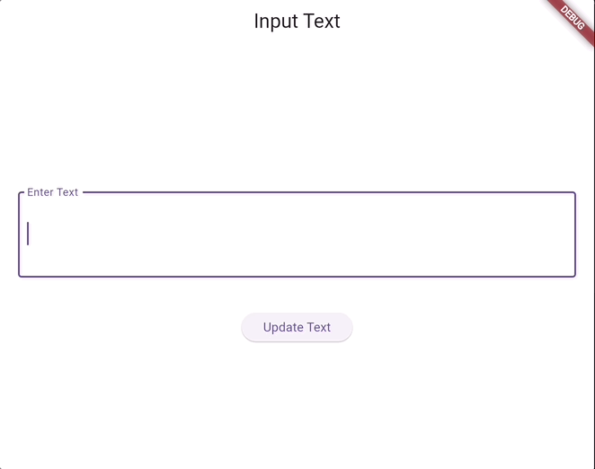

One key distinctive feature of a good developer is their ability to research the internet for solutions and workarounds. Conduct an internet research on how to add text input fields in Flutter and explore their various properties.

The end goal is to create a Flutter app that behaves like the following:

Hint: You'll need to use state to persist the data across the two screens as well as the techniques you learned about routing to help the user navigate back and forth between the screens.

Note: Feel free to use different colors, names and spacings. You're just required to make sure your app functions the same way as the demo app in the above GIF.
